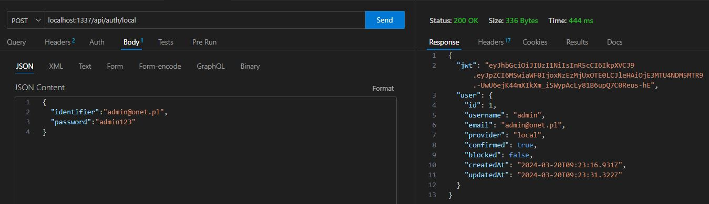
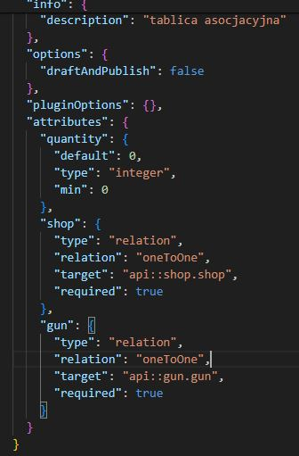
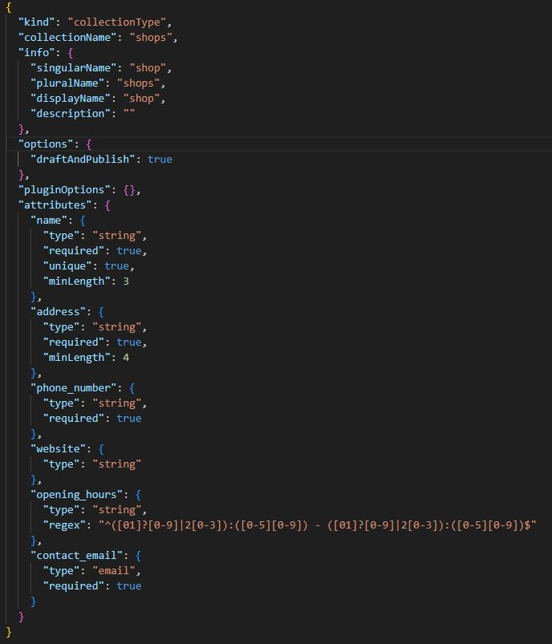
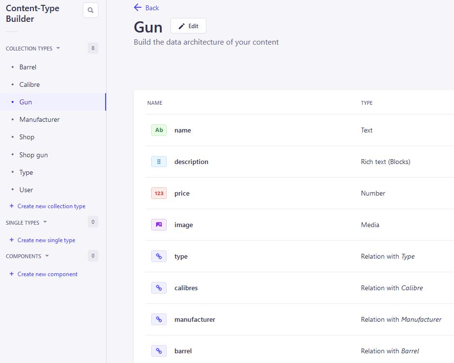
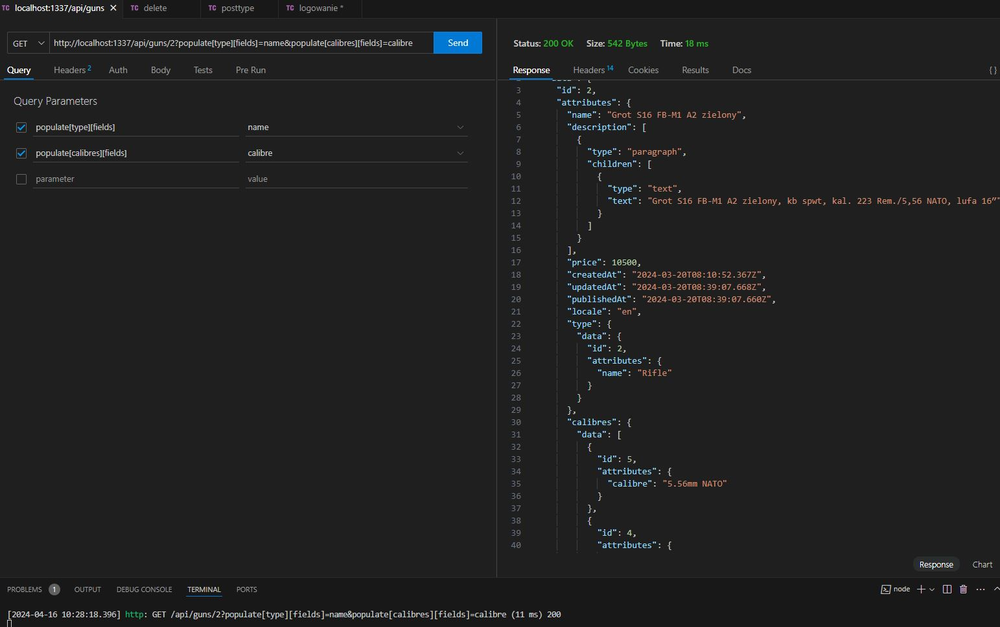

# Projekt Strapi - Gun Shop API

Projekt Strapi Gun Shop to RESTful API służące do zarządzania informacjami o broniach, sklepach, a także powiązaniach między nimi poprzez tablicę asocjacyjną.

Rafał M. - 14798

## Funkcjonalności

- CRUD dla broni, sklepów, kalibrów, producentów, i typów broni.
- Tablica asocjacyjna dla relacji broni i sklepów z informacją o ilości.
- Możliwość logowania i autentykacji za pomocą JWT.

## Technologie

- Strapi v4 - headless CMS oparty na Node.js.
- JWT - Tokeny do autentykacji.

## Przykłady użycia po zbudowaniu i uruchomieniu projektu

Logowanie w celu uzyskania jwt

Domyślnie nie można z poziomu content-type builder zaznaczyc by pole relacji było wymagane, można to wykonać wpisem w ../schema.json

Regex dla godzin otwarcia sklepu

Budowa tablicy Guns

Przechowywanie broni w poszczególnych sklepach - tablica asocjacyjna z ilością

## 📚 Learn more

- [Resource center](https://strapi.io/resource-center) - Strapi resource center.
- [Strapi documentation](https://docs.strapi.io) - Official Strapi documentation.
- [Strapi tutorials](https://strapi.io/tutorials) - List of tutorials made by the core team and the community.
- [Strapi blog](https://strapi.io/blog) - Official Strapi blog containing articles made by the Strapi team and the community.
- [Changelog](https://strapi.io/changelog) - Find out about the Strapi product updates, new features and general improvements.

Feel free to check out the [Strapi GitHub repository](https://github.com/strapi/strapi). Your feedback and contributions are welcome!

## ✨ Community

- [Discord](https://discord.strapi.io) - Come chat with the Strapi community including the core team.
- [Forum](https://forum.strapi.io/) - Place to discuss, ask questions and find answers, show your Strapi project and get feedback or just talk with other Community members.
- [Awesome Strapi](https://github.com/strapi/awesome-strapi) - A curated list of awesome things related to Strapi.

---

🤫 Psst! [Strapi is hiring](https://strapi.io/careers).
